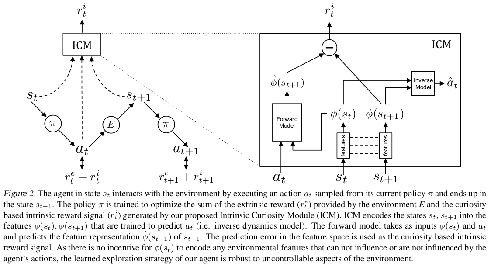

# Curiosity-driven Exploration by Self-supervised Prediction

* [arXiv](https://arxiv.org/pdf/1705.05363.pdf)
* [implementations](https://github.com/pathak22/noreward-rl)
* [demo](https://www.youtube.com/watch?v=J3FHOyhUn3A)

## TLDR

In environments where extrinsic rewards are sparse, curiosity can efficiently help to explore and even learn skills. In this work, they model a curiosity function for changes in the environment that are relevent for the agent's decisions. They then show state-of-the-art and novel performances even in environments where **no extrinsic reward** is given.

## Aim

They aim at showing that curiosity as intrinsic rewards can not only help for tasks where extrinsic rewards are sparse, but can also:
* help to continuously learn efficient exploratory policies that are specific to the environment,
* provide useful skills that are generalizable to other similar environments.

They also aim at introducing ICM (Intrinsic Curiosity Module), that is able to generate intrinsic rewards $r_i$ that have useful properties. ICM also scales well to high dimensional visual inputs.

## Methods

Their method is to add their novel Intrinsic Curiosity Module to the A3C algorithm. This new so-called agent A3C+ICM optimizes a loss function that has 2 terms:
* the loss of A3C that now considers $r_e + r_i$ instead of just $r_e$
* a loss for ICM (see Technical details)

ICM updates itself to both diminish the curiosity of visited states (using a forward network), and learn a feature representation of the states (using an inverse dynamic model) that aims at keeping information that come only from these 2 sources:
> 1. things that can be controlled by the agent 
> 2. things that the agent cannot control but that can affect the agent  

They give as an illustration of ICM that an agent should try to predict the consequences of its actions; when it fails in these predictions, it means that the state should be quite novel (ie rarely or never observed before). However, an agent should not become curious of how leaves move in trees even if their movements are quite unpredictable, since these changes in the observable environment are not included in the 2 sources detailed above.

## Technical details

The *inverse dynamic model* $g$ optimizes feature representations (function $\phi$ "hidden" in $g$) to then predict the action: 
$$\hat{a_t} = g(s_t,s_{t+1};\theta_I)$$
$$\underset{\theta_I}{min}\,\text{cross\_entropy}(a_t,\hat{a_t})$$

The *forward model* $f$ is used to compute the intrinsic reward $r_t^i$:
$$\hat{\phi}(s_{t+1}) = f(\phi(s_t),a_t;\theta_F)$$
$$\underset{\theta_F}{min}\,L_2(\hat{\phi}(s_{t+1}),\phi(s_{t+1}))$$
$$r_t^i=\eta L_2(\hat{\phi}(s_{t+1}),\phi(s_{t+1}))$$

In experiments, they used asynchronous versions of the A3C-based agents, with 20 parallel workers.

## Experiments - results

They present 3 settings of experiments and globally compare the algorithms A3C ($\epsilon$-greedy exploration), ICM+A3C, ICM(pixels)+A3C, TRPO, VIME+TRPO over the 2 environments VizDoom (with 2 maps and different degrees of sparsity) and Super Mario (3 maps). The algorithm ICM(pixels)+A3C aims at imitating a curiosity-driven algorithm with no useful abstraction of the state representation.

The 3 settings are:
* sparse extrinsic reward on reaching a goal
* exploration with no extrinsic reward
* generalization to novel scenarios

Here are some results:
* For reaching the final reward in sparse VizDoom:

| Algorithm | average % runs where the goal was achieved at convergence |
|--|--|
| A3C | 0.0% |
| ICM(pixels)+A3C | 100.0% |
| ICM+A3C | 100.0% |
| TRPO | 26.0% |
| VIME+TRPO | 46.1% |

* ICM is more robust to uncontrollable noise than ICM(pixels)+A3C (60% vs 100%)
* With no extrinsic reward, ICM explores the farthest rooms in VizDoom and 30% of level-1 of Mario
* For generalization, both in VizDoom and Mario, pre-train + fine-tune converges to exploring farther states than when training from scratch (even with total lower numbers of iterations) 

## Thoughts and takeaways

### pros

ICM is a robust module to omit useless distractions from the environment. 

A3C+ICM can learn in environment where **no extrinsic reward** is given.

### cons

Both environments studied are deterministic, so we have no clue if A3C+ICM would be robust to stochastic ones where the same sequence of actions could lead to different states. (Note that they add noise to the image in one experiment, but as stated, it does not impact the agent.)

As mentioned, an obstacle in Mario level-3 requires a specific sequence of actions to be crossed. A3C-ICM may hit "a curiosity blockade" and be "unable to make any progress" at some point.

### thoughts

Experiments suggest that A3C+ICM learns better policies (and new skills) when it is iteratively fine-tuned over increasingly difficult environments. (An exception of this is when generalizing from Level-1 to Level-3, where the agent performs better when run "as is", because of the obstacle mentioned above).

In the experiments, they do not provide us with the distribution of observed number of steps needed to achieve the goals in VizDoom (it would be nice to compare these with the approx. 250 optimal steps).


## Top Figures

> 
> 

## Metadata

```
@inproceedings{pathakICMl17curiosity,
    Author = {Pathak, Deepak and
    Agrawal, Pulkit and
    Efros, Alexei A. and
    Darrell, Trevor},
    Title = {Curiosity-driven Exploration
    by Self-supervised Prediction},
    Booktitle = {ICML},
    Year = {2017}
}
```

Tags: Reinforcement Learning ICM Intrinsic Curiosity Module A3C efficient exploration skill generalize Transfer Learning sparse rewards Mario VizDoom 
