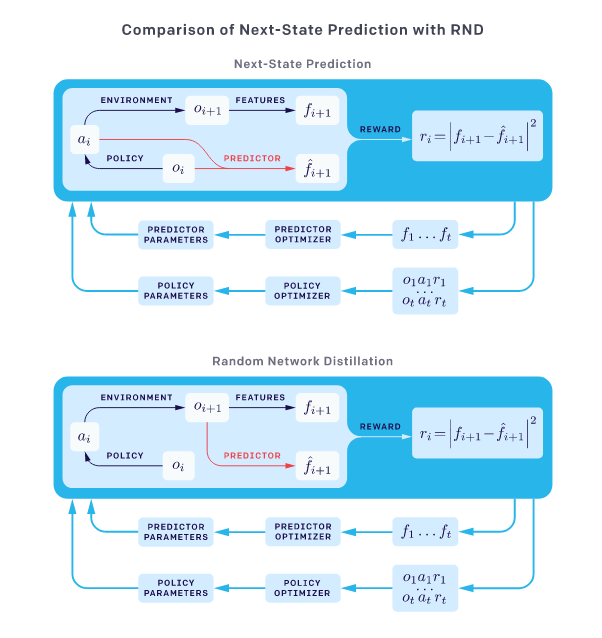

# Exploration by Random Network Distillation

> [arxiv](https://arxiv.org/abs/1810.12894)

> [code](https://github.com/openai/random-network-distillation)

## TLDR

This paper proposes an exploration bonus for deep reinforcement learning where the bonus is the error of a neural network predicting features of the observations given by a fixed randomly initialized Neural Network.

The paper also provides a method to flexibly combine intrinsic and extrinsic rewards.

## Aim

> objectives

* Reinforcement learning (RL) has difficulties dealing with sparse and hard to find extrinsic rewards.

> contributions

* This paper introduces an exploration bonus that is particularly simple to implement, works well with high-dimensional observations, can be used with any policy optimization algorithm, and is efficient to compute as it requires only a single forward pass of a neural network on a batch of experience. 

## Methods

> whats new in their approaches

* The exploration bonus is defined using a prediction problem where the answer is **deterministic** function of its inputs. The prediction is namely the output of a fixed randomly initialized neural network on the current observation.

* Combining intrinsic and extrinsic returns:
  * the exploration problem is non-episodic (arguably closed to how humans explore games)
  * the extrinsic reward problem is episodic, otherwise the agent would learn to exploit the first/closest reward and start over.
  * In practice, since the reward $$r_t$$ is simply the addition of the intrisinc ($$i_t$$) and extrinsic rewards ($$e_t$$), two value functions are used and fitted using their respective returns and linearly combined to give the value function $$V = V_E + V_I$$.

## Technical details

> mathematical notations, proofs

> setups

* In order to keep the rewards on a consistent scale, the intrinsic reward are normalized by dividing it by a running estimate of the standard deviations of intrinsic returns.

* Observation normalization is crucial when using a random neural network as a target. (See paragraph $2.4 for more details)

> parameterizing

## Experiments - results

> comparable experiments on typical dataset/environments...

* Montezuma's Revenge for hyperparameters search:
  * Pure exploration: achieve good results in itself.
  * Combining episodic and non-episodic returns: best combination is the one discussed above.
  * discount factors: very high for extrinsic rewards, only high for intrinsic rewards
  * Scaling up training (i.e. increasing the number of parallel environments): the more environments there are, the better
  * RNN vs CNN policy: RNN better

* Montezuma's Revenge algorithms benchmark:
  * Setup: 30k rollouts of length 128 per env. (128 env. in parallel): 1.97 billion frames of experience
  * Random Network Distillation
  * PPO (no exploration bonus)
  * Dynamics (exploration bonus based on forward dynamics error - i.e. next-observation prediction)

> breakthroughs

* New SOTA on Gravitar and Montezuma's Revenge by a fair margin.

## My thoughts and takeaways

> pros

* Simple to implement
* Scalable to multiple parallel environments
* High-dimensions exploration available

> cons

* Global exploration that involves coordinated decisions over long time horizons is out of reach yet much needed to consistently solve these complex (yet simple) environments. 

> related stuff

## Top Figures

> 

## Metadata

> easily grep-able data: tags, reading depth

> bibtex: author list, title, published year, journal, URL, etc
 ```
 @article{Burda2018ExplorationBR,
  title={Exploration by Random Network Distillation},
  author={Yuri Burda and Harrison A Edwards and Amos J. Storkey and Oleg Klimov},
  journal={CoRR},
  year={2018},
  volume={abs/1810.12894}
}
```
